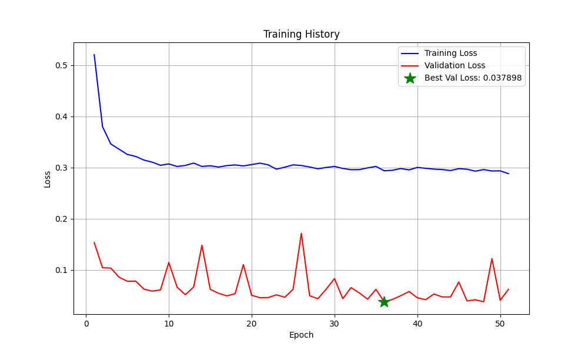

# Intelligent Control Training for Image-Based Visual Servoing


## Table of contents

- [[#1. Concept of the project:|1. Concept of the project]]
- [[#2. FIRST TASK: Generate a datasets|2. FIRST TASK: Generate a datasets]]
	- [[#2. FIRST TASK: Generate a datasets#2.1 How to run the code:|2.1 How to run the code]]
	- [[#2. FIRST TASK: Generate a datasets#2.2 General explication of the code|2.2 General explication of the code]]
		- [[#2.2 General explication of the code#Other involved files|Other involved files]]
	- [[#2. FIRST TASK: Generate a datasets#2.3 Dataset structure|2.3 Dataset structure]]
		- [[#2.3 Dataset structure#Inputs|Inputs]]
		- [[#2.3 Dataset structure#Outputs|Outputs]]
- [[#3. SECOND TASK: Design the training process|3. SECOND TASK: Design the training process]]

## 1. Concept of the project:

This project explores the integration of artificial intelligence into robot control systems, specifically through the use of artificial neural networks. It builds on previous work with vision-based control approaches and aims to develop a neural network-based controller that can replace traditional control strategies.
## 2. FIRST TASK: Generate a datasets

The goal is to generate a dataset (for training, validation, and testing) by simulating a traditional control system. These datasets will serve as the learning foundation for a neural network. The data is created by running a vision-based controller and recording relevant control inputs and outputs
### 2.1 How to run the code:

**Create the python environment, for which:**

a) You must have **python installed**

b) You can either run (from the root directory of the project):
``` bash
source scripts/.prepare_environment.bash
```

c) Or run the build task made for preparing the environment (from VSCode):
```
F1 > Tasks: Run Build Task > Setup Python Environment
```
This will install all necessary dependencies for running the code

With the environment created, and all the requirements met. The **generation can be started**. 
For testing, there is a script that can be run like:
```bash
source scripts/DATASET_GenerateFullDataSet.bash
```
For running the full dataset generation (defaulting to 20K sequences), there is another script:

### 2.2 General explication of the code

The main script creates a `IVBS` object with the following constraints to make the data consistent:
- **Camera**: `CenteredCamera` with default parameters (with a random position for each sequence)
- **Points to follow**: Set of 4 points, created with the `mkgrid()` method, with a side of 0.5 and a random position in space, forming a plain parallel to the image plain
**Note that:** *For all parameters' random positions, minimum and maximum distances to the* $P(0,0,0)$ *have been set just so the points are not too far away*

Then, for each sequence, the `IVBS` controller is ran step by step and the data from its control is collected in a list of `RowData` objects (defined in `lib/DataStoring.py`) to then be serialized in bunches to save some space in memory.
#### Other involved files

Libraries inside `{root}/lib`:
- `DataStoring`: In charge of storing the data to a specified file in CSV format, with each row containing a complete state of the system
- `IBVSMachineLearning`: Implementation of the ML-based IBVS controller that will replace the traditional control law
### 2.3 Dataset structure

The dataset contains information that can be divided into two groups, depending on whether they will be used as **input** or **output** for training the Machine Learning algorithm
#### Inputs:

- `current_features`: The positions on the image plane (in $px$) of the arranged points, as seen by the camera in a certain moment. Set of four points, with two coordinates each $(x, y)$, flattened into a vector of size 8.

#### Outputs:
- `velocity_command`: Camera velocity command consisting of linear velocities [vx, vy, vz], vector of size 3
  - **Note**: Angular velocities (wx, wy, wz) are present in the dataset but contain only numerical noise (≈1e-15) and are excluded from training

#### Additional data:
Each row in the dataset also includes:
- `sequence_id`: Identifier for the sequence of movements
- `timestep`: Current step within the sequence
- `desired_features`: The positions on the image plane (in $px$) of the arranged points, as desired when the position is final and correct. Set of four points, with two coordinates each $(x, y)$, flattened into a vector of size 8.
- `feature_error`: Scalar value representing the norm of the feature error between current and desired positions

> Comments about these parameters:
> - `sequence_id` and `timestamp` are paraameters just to keep track of which sequence and which position each line is from
> - `desired_features` could be used for training if we wanted a more generalistic model that could account for any desired robot position, but we will keep to a known set of desired positions to reduce the dimensionality of the dataset. However, these values will be saved just for data consistency purposes.
> - `feature_error` will be used to check the validity of the system

## 3. SECOND TASK: Design the training process

### 3.1 Real-time Web Monitoring Interface

A web-based monitoring system has been implemented to track neural network training progress in real-time:

**Features:**
- **Real-time metrics display**: Current epoch, training/validation losses
- **Interactive loss curves**: Plotly graphs showing training progress with best epoch markers
- **Model configuration display**: Training parameters and model architecture
- **Responsive design**: Works on desktop and mobile devices
- **Auto-refresh**: Updates every second during training

**Usage:**
```bash
# Start web monitor (automatically launched during training)
python web_view.py

# Access from browser
http://localhost:5000

# Access from phone (same WiFi network)
http://[YOUR_IP]:5000
```

**Technical Implementation:**
- Flask server with file system monitoring (watchdog)
- JSON metadata files updated after each epoch with performance metrics
- Modern HTML/CSS interface with Plotly.js for interactive graphs
- WebSocket-like updates via REST API polling
- Comprehensive performance tracking: timing, throughput, memory usage
- Dual-axis plots for correlated metrics visualization

### 3.2 Dataset Corrections and Findings

**Important Discovery:** Analysis of the generated dataset revealed that angular velocities (wx, wy, wz) contain only numerical noise (≈1e-15), effectively making this a **3DOF control problem** rather than 6DOF.

**Changes Made:**
- Updated target columns from `['vx', 'vy', 'vz', 'wx', 'wy', 'wz']` to `['vx', 'vy', 'vz']`
- Modified all model configurations to output 3 values instead of 6
- This resolved training issues where loss was stuck at 0.5

**Dataset Statistics:**
- Total samples: 1,686,070
- Input features: 8 (current_feature_0 through current_feature_7)
- Output targets: 3 (vx, vy, vz only)
- Linear velocity ranges: ±0.66 m/s
- Angular velocities: Effectively zero (numerical noise only)

### 3.3 Model Architecture Analysis

Several neural network architectures can be considered for learning the IBVS control law. Here's an analysis of potential approaches:

#### 3.1.1 Feedforward Neural Network (FNN)
**How it works:**
- Information flows in one direction, from input to output through layers of neurons
- Each neuron computes a weighted sum of its inputs, applies an activation function
- No cycles or loops in the network structure
- Learns direct mappings between inputs and outputs through backpropagation

**Sources:** [Stanford's Deep Learning Tutorial on FFNs](http://ufldl.stanford.edu/tutorial/supervised/MultiLayerNeuralNetworks/)

**Advantages:**
- Simple implementation
- Fast inference time
- Good for learning direct mappings
- Suitable for real-time control

**Architecture:**
```python
Input (8) -> Dense(64) -> ReLU -> Dense(32) -> ReLU -> Dense(3)
```
- Input: Current features only (8 coordinates)
- Output: 3-DOF linear velocity command (vx, vy, vz)
- Suitable for cases where temporal dynamics are less important
- **Updated**: Simplified architecture with dropout (0.3) and batch normalization for better generalization

#### 3.1.2 Recurrent Neural Network (RNN/LSTM)
**How it works:**
- Processes sequences by maintaining an internal memory state
- LSTM (Long Short-Term Memory) cells have gates to control information flow
- Can remember important information for long sequences
- Well-suited for time-series and sequential data

**Sources:** [Understanding LSTM Networks by Christopher Olah](https://colah.github.io/posts/2015-08-Understanding-LSTMs/)

**Advantages:**
- Can learn temporal dynamics
- Maintains internal state
- Better for smooth trajectories
- Can handle varying sequence lengths

**Architecture:**
```python
Input (8) -> LSTM(64) -> LSTM(64) -> Dense(3)
```
- Considers past states for better trajectory planning
- More suitable when temporal consistency is important
- **Updated**: Output size corrected to 3 for linear velocities only

#### 3.1.3 Residual Network (ResNet)
**How it works:**
- Uses skip connections that bypass one or more layers
- Allows direct flow of information across layers
- Helps solve the vanishing gradient problem in deep networks
- Each layer learns residual functions with reference to layer inputs

**Sources:** [Deep Residual Learning Paper by Microsoft Research](https://arxiv.org/abs/1512.03385)

**Advantages:**
- Better gradient flow
- Can learn incremental adjustments
- Suitable for fine control
- Good for deep architectures

**Architecture:**
```python
Input (8) -> [Dense(64) -> ReLU -> Dense(64) + Skip] x 3 -> Dense(3)
```
- Skip connections help maintain gradient flow
- Good for learning corrections to basic control laws
- **Updated**: Output size corrected to 3 for linear velocities only

#### 3.1.4 Hybrid Architecture
**How it works:**
- Combines multiple neural network types into one system
- Different components process different aspects of the input
- Can leverage strengths of multiple architectures
- Usually involves a feature extractor followed by a decision maker

**Sources:** [Survey on Deep Multi-modal Learning by Nature](https://www.nature.com/articles/s41598-021-85221-6)

**Advantages:**
- Combines multiple approaches
- Can separate spatial and temporal features
- More flexible learning capacity

**Architecture:**
```python
Features -> CNN for spatial features
         -> LSTM for temporal dynamics
         -> Merge -> Dense layers -> Output(3)
```
- More complex but potentially more powerful
- Can handle both spatial and temporal aspects
- **Updated**: Output size corrected to 3 for linear velocities only

### 3.4 Training Configuration and Improvements

**Centralized Configuration** (`model_training/config.py`):
- Batch size: 64
- Learning rate: 0.0005 (reduced for stability)
- Early stopping: 15 epochs patience, 1e-5 min delta
- Weight decay: 1e-3 for regularization
- Learning rate scheduler: ReduceLROnPlateau (factor=0.3, patience=5)

**Training Improvements Made:**
1. **Architecture Simplification**: Reduced FNN from [256,128,64,32] to [64,32] layers
2. **Increased Regularization**: Dropout 0.1→0.3, weight decay 1e-4→1e-3
3. **Better Initialization**: Improved He initialization for ReLU networks
4. **Learning Rate Scheduling**: Added ReduceLROnPlateau for adaptive learning
5. **Early Stopping**: Reduced patience to prevent overfitting
6. **Data Normalization**: StandardScaler for both features and targets

**File Structure:**
```
model_training/
├── config.py              # Centralized training configuration
├── train_fnn.py           # FNN training script
├── train_lstm.py          # LSTM training script
├── train_resnet.py        # ResNet training script
└── train_hybrid.py        # Hybrid model training script

training_models/           # Generated during training
├── {model}_best.pth      # Best model weights
├── {model}_metadata.json # Training metadata for web monitor
├── {model}_feature_scaler.pkl  # Feature normalization
└── {model}_target_scaler.pkl   # Target normalization
```

### 3.5 Evaluation Metrics

To compare these architectures, we'll use the following metrics:

1. **Control Performance**
   - Final positioning error
   - Convergence time
   - Trajectory smoothness
   - Success rate

2. **Computational Efficiency**
   - Inference time
   - Model size
   - Memory usage
   - CPU/GPU utilization

3. **Training Characteristics**
   - Training time
   - Sample efficiency
   - Loss convergence
   - Generalization to new scenarios

### 3.6 Implementation Strategy

1. **Data Preprocessing**
   - Normalize input features and targets using StandardScaler
   - Split data into train/validation/test sets (80/20 split)
   - Handle sequence grouping for temporal models
   - **Note**: Data augmentation was tested but removed per user preference

2. **Training Process**
   ```bash
   # Train specific models
   PYTHONPATH=. python model_training/train_fnn.py --data_path training_generation/data_0.csv
   PYTHONPATH=. python model_training/train_lstm.py --data_path training_generation/data_0.csv
   PYTHONPATH=. python model_training/train_resnet.py --data_path training_generation/data_0.csv
   PYTHONPATH=. python model_training/train_hybrid.py --data_path training_generation/data_0.csv
   
   # Web monitor automatically starts during training
   # Access at http://localhost:5000
   ```

3. **Validation**
   - Cross-validation on different scenarios
   - Test on unseen initial conditions
   - Evaluate robustness to noise
   - Compare with classical IBVS

### 3.7 Recommended Testing Procedure

1. **Basic Testing**
   - Train each model with default parameters
   - Quick evaluation on validation set
   - Eliminate clearly underperforming architectures

2. **Hyperparameter Optimization**
   - Grid search for remaining architectures
   - Focus on key parameters (learning rate, layer sizes)
   - Use validation performance as metric

3. **Detailed Evaluation**
   - Comprehensive testing on test set
   - Record all metrics
   - Statistical analysis of results
   - Visualization of trajectories

4. **Real-world Considerations**
   - Computational requirements
   - Implementation complexity
   - Maintenance needs
   - Scalability

### 3.8 Expected Outcomes

Based on similar applications in robotics control:

1. **FNN** might be sufficient for basic control
   - Good baseline performance
   - Easiest to implement and deploy
   - May lack smoothness in trajectories

2. **LSTM** likely better for smooth control
   - Better trajectory consistency
   - Higher computational cost
   - More complex training process

3. **ResNet** good for precise control
   - Better final accuracy
   - Good gradient flow
   - Moderate complexity

4. **Hybrid** potentially best performance
   - Most complex to implement
   - Highest computational cost
   - Most flexible for different scenarios

### 3.9 Next Steps

1. Implement baseline models
2. Set up evaluation pipeline
3. Run initial comparisons
4. Refine promising architectures
5. Detailed analysis of best performers
6. Final model selection

## 4. TROUBLESHOOTING AND KEY FIXES

### 4.1 Common Issues and Solutions

**Problem: Loss stuck at 0.5 and not decreasing**
- **Root Cause**: Dataset contained 6 target outputs but only 3 had meaningful values
- **Solution**: Analyzed dataset and discovered angular velocities were numerical noise
- **Fix**: Changed from 6DOF to 3DOF output (vx, vy, vz only)

**Problem: Training loss decreasing but validation loss oscillating**
- **Root Cause**: Model overfitting due to high complexity
- **Solution**: Reduced model complexity and increased regularization
- **Fixes Applied**:
  - Simplified FNN architecture: [256,128,64,32] → [64,32]
  - Increased dropout: 0.1 → 0.3
  - Added weight decay: 1e-4 → 1e-3
  - Reduced learning rate: 0.001 → 0.0005

**Problem: Web interface not accessible from phone**
- **Root Cause**: Flask server bound to localhost only
- **Solution**: Configure server to accept external connections
- **Fix**: Set `host='0.0.0.0'` in Flask app.run()
- **Access**: Use computer's IP address (e.g., http://192.168.1.100:5000)

### 4.2 Performance Monitoring

**Real-time Monitoring:**
- Web interface shows live training progress
- Loss curves with best epoch markers
- Performance metrics visualization with dual-axis plots
- Training configuration display
- Mobile-friendly responsive design
- Live performance tracking: epoch duration, samples/sec, memory usage

**Training History Visualization:**
Each model training automatically generates a comprehensive training history plot saved as `training_models/{model_name}_training_history.png`. This graph shows:
- Training loss progression (blue line)
- Validation loss progression (red line)  
- Best validation loss epoch (gold star marker)
- Clear visualization of convergence patterns and overfitting detection


*Example: FNN model training history showing successful convergence with early stopping*

**Performance Metrics Dashboard:**
The web interface now includes comprehensive performance tracking with interactive charts:
- **Training Speed Plot**: Dual-axis visualization showing samples/second (green) and epoch duration (orange)
- **Resource Usage Plot**: Memory consumption (purple) and learning rate progression (red, log scale)
- **Real-time Updates**: All metrics update every second during training
- **Mobile Optimized**: Touch-friendly interface with responsive design

**Key Metrics to Watch:**
- Training vs validation loss divergence (overfitting indicator)
- Learning rate decay progression
- Early stopping patience counter
- Best validation loss epoch
- Training speed (samples/second)
- Memory usage trends

### 4.3 Dependencies and Requirements

**Core Dependencies:**
```bash
torch>=1.9.0
numpy>=1.21.0
pandas>=1.3.0
scikit-learn>=1.0.0
matplotlib>=3.4.0
tqdm>=4.62.0
flask>=2.0.0
watchdog>=2.1.0
plotly>=5.0.0
```

**Installation:**
```bash
pip install -r requirements.txt
```

Would you like me to:
1. Provide specific implementation details for any architecture?
2. Add more evaluation metrics?
3. Expand on any particular section?