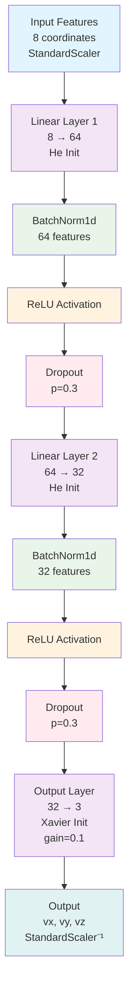

# FNN (Feedforward Neural Network) Architecture

## Model Configuration
- **Input Size**: 8 (current image features)
- **Hidden Layers**: [64, 32]
- **Output Size**: 3 (vx, vy, vz velocities)
- **Dropout Rate**: 0.3
- **Batch Normalization**: Enabled
- **Activation**: ReLU
- **Weight Initialization**: He (Kaiming) for hidden layers, Xavier for output

## Architecture Diagram

## Layer Details

### Input Processing
- **StandardScaler**: Normalizes input features to zero mean, unit variance
- **Input Shape**: (batch_size, 8)

### Hidden Layer 1
- **Linear**: 8 → 64 neurons
- **BatchNorm1d**: Normalizes activations across batch dimension
- **ReLU**: Non-linear activation function
- **Dropout**: 30% of neurons randomly set to zero during training

### Hidden Layer 2
- **Linear**: 64 → 32 neurons
- **BatchNorm1d**: Normalizes activations across batch dimension
- **ReLU**: Non-linear activation function
- **Dropout**: 30% of neurons randomly set to zero during training

### Output Layer
- **Linear**: 32 → 3 neurons (vx, vy, vz)
- **Xavier Initialization**: Smaller weights (gain=0.1) for stability
- **No Activation**: Linear output for regression

### Output Processing
- **Inverse StandardScaler**: Denormalizes predictions back to original scale
- **Output Shape**: (batch_size, 3)

## Training Details
- **Loss Function**: MSE (Mean Squared Error)
- **Optimizer**: Adam with weight decay (1e-3)
- **Learning Rate**: 0.0005 with ReduceLROnPlateau scheduler
- **Batch Size**: 64
- **Early Stopping**: Patience 15 epochs, min_delta 1e-5 