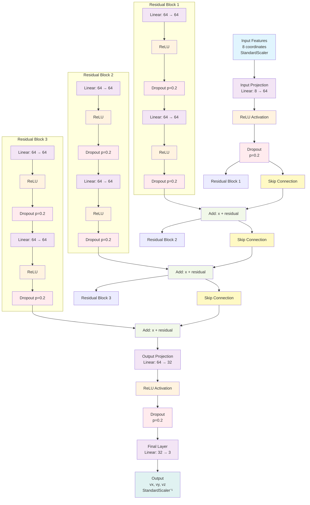

# ResNet (Residual Network) Architecture

## Model Configuration
- **Input Size**: 8 (current image features)
- **Hidden Size**: 64
- **Number of Blocks**: 3
- **Output Size**: 3 (vx, vy, vz velocities)
- **Dropout Rate**: 0.2
- **Skip Connections**: Identity mapping with residual learning

## Architecture Diagram



## Layer Details

### Input Processing
- **StandardScaler**: Normalizes input features to zero mean, unit variance
- **Input Shape**: (batch_size, 8)
- **Input Projection**: Transforms 8 features to 64-dimensional hidden space

### Residual Blocks (×3)
Each residual block contains:
- **Linear Layer 1**: 64 → 64 neurons
- **ReLU Activation**: Non-linear activation function
- **Dropout**: 20% of neurons randomly set to zero during training
- **Linear Layer 2**: 64 → 64 neurons
- **ReLU Activation**: Non-linear activation function
- **Dropout**: 20% of neurons randomly set to zero during training
- **Skip Connection**: Identity mapping `F(x) = H(x) + x`

### Residual Learning Formula
```
Output = x + F(x)
```
Where:
- `x` is the input to the residual block
- `F(x)` is the residual function learned by the block
- The network learns the residual mapping rather than the direct mapping

### Skip Connection Benefits
- **Gradient Flow**: Enables direct gradient flow through skip connections
- **Deep Training**: Allows training of deeper networks without vanishing gradients
- **Identity Mapping**: Preserves information from earlier layers
- **Easier Optimization**: Network can learn identity function if needed

### Output Processing
- **Output Projection**: 64 → 32 → 3 neurons
- **Final Activation**: ReLU before final layer
- **Final Dropout**: 20% regularization before output
- **Linear Output**: No activation on final layer for regression

### Output Processing
- **Inverse StandardScaler**: Denormalizes predictions back to original scale
- **Output Shape**: (batch_size, 3)

## Mathematical Formulation

### Residual Block Function
```
H(x) = F(x) + x
```

### Complete Forward Pass
```
x₀ = InputProjection(input)
x₁ = ResidualBlock₁(x₀) = F₁(x₀) + x₀
x₂ = ResidualBlock₂(x₁) = F₂(x₁) + x₁
x₃ = ResidualBlock₃(x₂) = F₃(x₂) + x₂
output = OutputProjection(x₃)
```

## Training Details
- **Loss Function**: MSE (Mean Squared Error)
- **Optimizer**: Adam with weight decay (1e-3)
- **Learning Rate**: 0.0005 with ReduceLROnPlateau scheduler
- **Batch Size**: 64
- **Early Stopping**: Patience 15 epochs, min_delta 1e-5
- **Gradient Flow**: Skip connections enable stable gradient propagation 